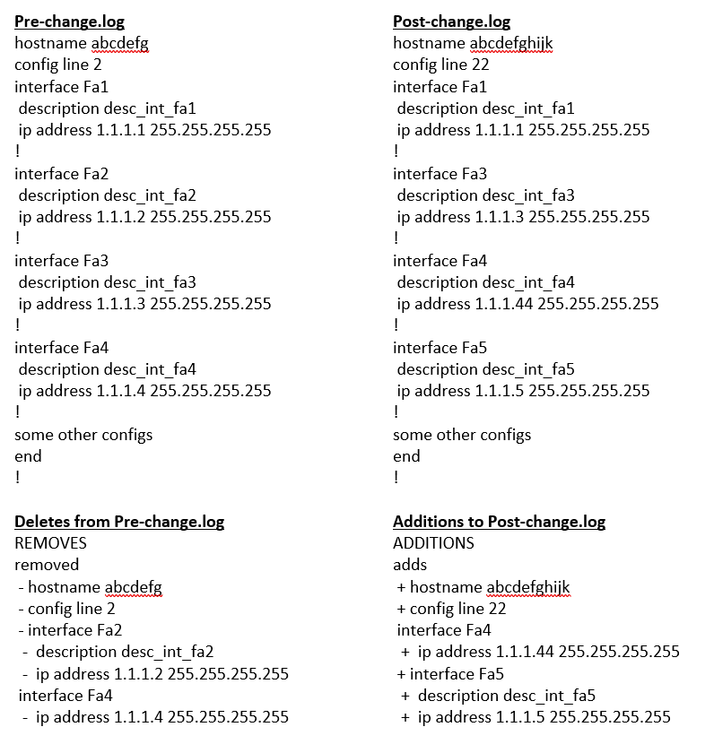

Compare two Text files for differences
============================================

**Example Use Case:** Compare Pre/Post configuration files and provides differences between two configuration files

Here is how to do

Sample Execution Code for text Compare
--------------------------------------

.. code-block:: python
	:emphasize-lines: 1, 5, 10,11,12, 19, 26

	# # Step. 1: Import necessary modules
	from compare_it import CompareText, get_string_diffs
	from nettoolkit import IO

	# # Step. 2: Define Input fies.
	f1 = 'pre-change.log'
	f2 = 'post-change.log'
	output_file = "delta_differences.txt"

	# # Step. 3: Compare two files for adds/removals usng "CompareText"
	# #        : Differences are stored under object.CTobj.diff dictionary
	# #        : Extract it to a separate dictionary.
	diff = {}
	removals = CompareText(f1, f2, "- ")
	adds = CompareText(f2, f1, "+ ")
	diff['removed'] = removals.CTObj.diff
	diff['adds'] = adds.CTObj.diff

	# # Step. 4: convert the dictionary to string format using "get_string_diffs"
	difference_dict_labels = {'adds': "ADDITIONS", 'removed': "REMOVES" }	# arbitrary Header
	diff_str = get_string_diffs(diff, 
		hn='HEADER [hostname]', 					# provide arbitrary hostname
		difference_dict_labels=difference_dict_labels 
		)

	# # Step. 5: Write the text difference now to a text file using "nettoolkig.IO"
	IO.to_file(output_file, matter=diff_str)

Snap of Execution for Cisco Style configurations
---------------------------------------------------

Snap of Execution for Juniper Style configurations
---------------------------------------------------

.. image:: img/txt_diffs_juniper_style.png
